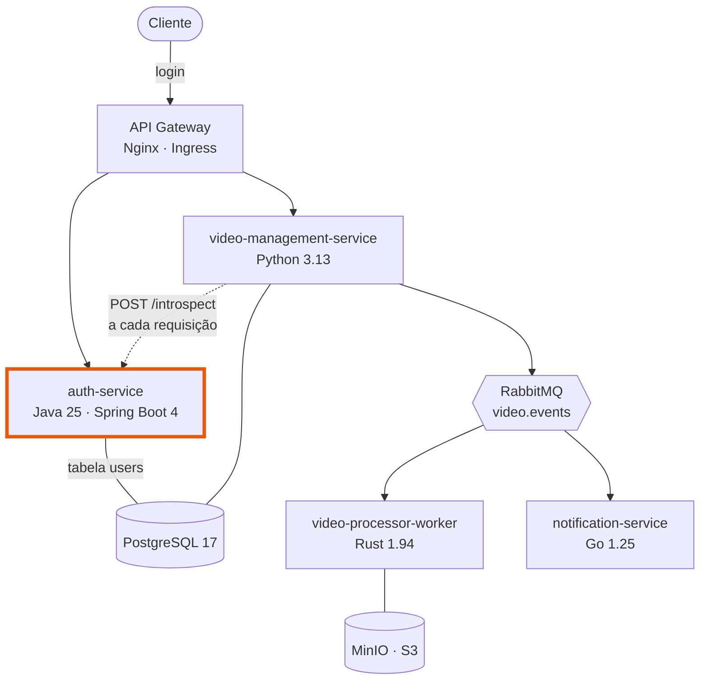

# fiapx-auth-service

Autenticação do **FIAP X**: cadastro de usuários, login com emissão de JWT e introspecção
de token para os demais microsserviços.

**Java 25 (LTS)** · Spring Boot 4 · Spring Security · Spring Data JPA · Flyway

## Repositórios do projeto

| Repositório | Linguagem | Papel |
| :--- | :--- | :--- |
| [fiapx-platform](https://github.com/rodolfomedeiros/fiapx-platform) | — | Compose, Kubernetes, contratos, topologia do broker |
| **fiapx-auth-service** *(você está aqui)* | Java 25 · Spring Boot 4 | Cadastro, login, emissão e introspecção de JWT |
| [fiapx-video-management-service](https://github.com/rodolfomedeiros/fiapx-video-management-service) | Python 3.13 · FastAPI | Upload, listagem, download e WebSocket de tempo real |
| [fiapx-video-processor-worker](https://github.com/rodolfomedeiros/fiapx-video-processor-worker) | Rust 1.94 · Tokio | Extração de quadros com FFmpeg e compactação em `.zip` |
| [fiapx-notification-service](https://github.com/rodolfomedeiros/fiapx-notification-service) | Go 1.25 | Consumo da DLQ e envio de e-mail de falha |
| [fiapx-web](https://github.com/rodolfomedeiros/fiapx-web) | React 19 · TypeScript 6 | Interface de upload, acompanhamento e download |

> Para subir o sistema inteiro, use o **fiapx-platform**. Este repositório sozinho precisa
> de um PostgreSQL acessível.

## Onde este serviço entra



O serviço de vídeos **não** valida o JWT por conta própria: ele chama
`POST /api/v1/auth/introspect`. Assim a chave de assinatura nunca sai deste serviço, e
revogar ou trocar o segredo não exige redeploy dos demais. O custo dessa chamada extra por
requisição é amortizado por um cache no Redis, do lado do serviço de vídeos.

## API

Caminhos internos são `/api/v1/auth/*`; pelo gateway do Compose, `/auth/*`.

### `POST /api/v1/auth/register`

```json
{ "name": "Ana", "email": "ana@example.com", "password": "senha-bem-longa" }
```

`201` devolve `{ "id", "name", "email" }`. O e-mail é normalizado para minúsculas e a senha
guardada com BCrypt — nunca em claro, e nunca devolvida.

| Regra | Resposta |
| :--- | :--- |
| `name` até 100 caracteres, `email` válido, `password` de 8 a 128 | `400` se violada |
| E-mail já cadastrado | `409` |

### `POST /api/v1/auth/login`

```json
{ "email": "ana@example.com", "password": "senha-bem-longa" }
```

`200` devolve `{ "access_token", "token_type": "Bearer", "expires_in": 3600 }`.
Credenciais inválidas devolvem `401`.

O login compara um hash **mesmo quando o e-mail não existe**, para que o tempo de resposta
não revele quais contas estão cadastradas.

### `POST /api/v1/auth/introspect`

Recebe `Authorization: Bearer <token>` e sempre responde `200`:

```json
{ "active": true, "sub": "<uuid>", "email": "ana@example.com", "name": "Ana" }
```

Token ausente, malformado, expirado ou assinado com outra chave devolve
`{ "active": false }`, com os demais campos omitidos.

### Operacionais

| Endpoint | Uso |
| :--- | :--- |
| `GET /actuator/health/readiness` | Probe de readiness |
| `GET /actuator/health/liveness` | Probe de liveness |
| `GET /actuator/prometheus` | Métricas |

## Configuração

| Variável | Padrão | Descrição |
| :--- | :--- | :--- |
| `DATABASE_URL` | `jdbc:postgresql://localhost:5432/fiapx` | JDBC do PostgreSQL |
| `DATABASE_USERNAME` | `fiapx` | Usuário do banco |
| `DATABASE_PASSWORD` | `fiapx` | Senha do banco |
| `JWT_SECRET` | valor de desenvolvimento | Segredo HMAC — **mínimo 32 bytes** |
| `JWT_EXPIRATION_MINUTES` | `60` | Validade do token emitido |
| `PORT` | `8081` | Porta HTTP |

## Organização

| Arquivo | Responsabilidade |
| :--- | :--- |
| `AuthController.java` | Rotas de cadastro, login e introspecção |
| `JwtService.java` | Emissão e verificação do token, desacoplado da entidade JPA |
| `User.java` / `UserRepository.java` | Entidade e acesso à tabela `users` |
| `SecurityConfig.java` | Cadeia de filtros do Spring Security |
| `db/migration/V1__create_users.sql` | Migração Flyway da tabela `users` |

`spring.jpa.hibernate.ddl-auto` está em `validate`: a aplicação recusa subir se o schema
encontrado não corresponder ao mapeamento, em vez de alterar o banco silenciosamente.

## Executar

```sh
mvn spring-boot:run
```

Com o PostgreSQL do Compose já de pé, os padrões das variáveis funcionam sem configuração
adicional.

## Testes

```sh
mvn test
```

14 testes cobrindo emissão e verificação do token (expiração, assinatura adulterada,
payload adulterado, token malformado), cadastro com e-mail duplicado, validação de payload
e todas as respostas de introspecção. Não é necessário banco: o repositório é substituído
por um mock e as rotas rodam em `MockMvc` standalone.
